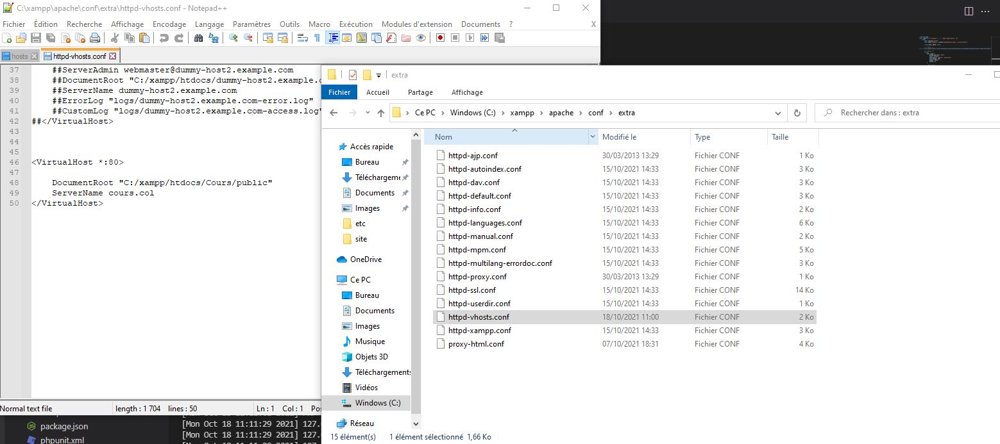
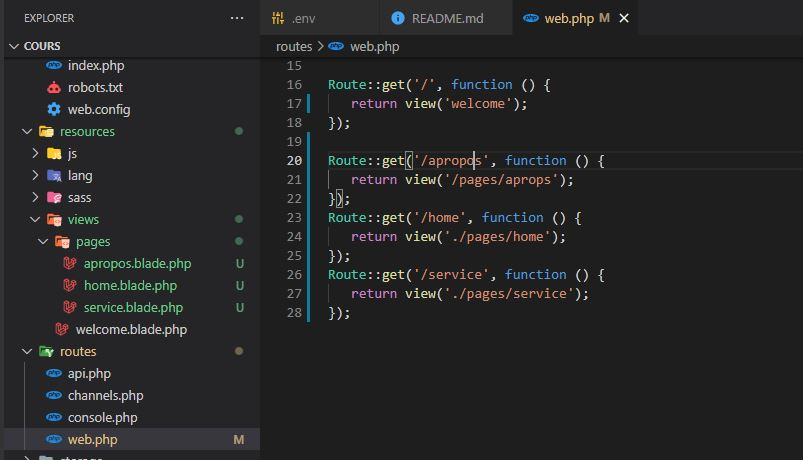

# Laravel Insta V 7.*
---------------------
## installation
 composer
## config
 - local host 
  
 - Apres 
    ``` sys32\drivers\hosts ```
##### web.php
``` PHP
Route::get('/apropos/{nom}/{id}', function ($nom,$id) {
    // return view('welcome'); //resources/views/welcome.blade.php
    return '<h1>mon nom est '.$nom.' et mon id est '.$id.'</h1>';
 });
```



``` Bash
php artisan make:controller PagesController
```
``` PHP
#ETAPE 1 dans web.php
Route::get('/service', 'PagesController@service');
Route::get('/home', 'PagesController@home');
Route::get('/apropos', 'PagesController@apropos');
#ETAPE 2 dans pagecontroller
class PagesController extends Controller
{
    public function service () {
    return view('pages.service');
        }

        public function apropos () {
            return view('pages.apropos');
                }
        public function home () {
          return view('pages.home');
                 }                
}
```
 - ######  Blade Templates