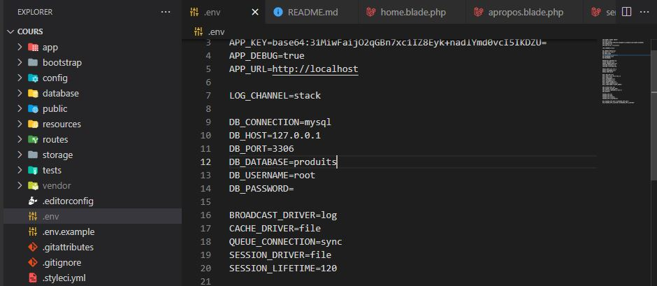
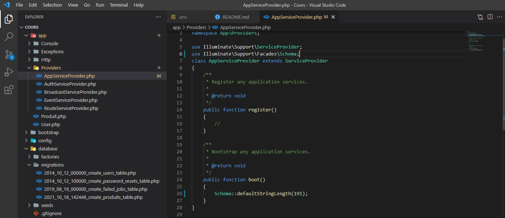
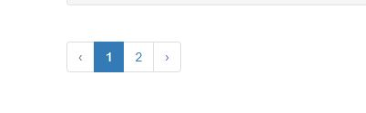
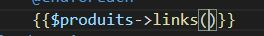

---------------------
## installation
##### Pour ce Projet 
- Edit database Produits in .env
- Run composer install
- Run php artisan key:generate
- Run php artisan migrate
- Dans BD ajouter columne description
- Run php artisan serve

##### Required
   composer
   php >= 7.2
## config
 - local host 
  
 - Apres 
    ``` sys32\drivers\hosts ```
##### web.php
``` PHP
Route::get('/apropos/{nom}/{id}', function ($nom,$id) {
    // return view('welcome'); //resources/views/welcome.blade.php
    return '<h1>mon nom est '.$nom.' et mon id est '.$id.'</h1>';
 });
```


``` console
foo@bar:~$php artisan make:controller PagesController
```
``` PHP
#ETAPE 1 dans web.php
Route::get('/service', 'PagesController@service');
Route::get('/home', 'PagesController@home');
Route::get('/apropos', 'PagesController@apropos');
#ETAPE 2 dans pagecontroller
class PagesController extends Controller
{
    public function service () {
    return view('pages.service');
        }

        public function apropos () {
            return view('pages.apropos');
                }
        public function home () {
          return view('pages.home');
                 }                
}
```
 - ######  Blade Templates

``` PHP
#Etape 1
<!DOCTYPE html>
<html lang="en">
<head>
  <title>Laravel 7.X</title>
  <meta charset="utf-8">
  <meta name="viewport" content="width=device-width, initial-scale=1">
  <link rel="stylesheet" href="https://maxcdn.bootstrapcdn.com/bootstrap/3.4.1/css/bootstrap.min.css">
  <script src="https://ajax.googleapis.com/ajax/libs/jquery/3.5.1/jquery.min.js"></script>
  <script src="https://maxcdn.bootstrapcdn.com/bootstrap/3.4.1/js/bootstrap.min.js"></script>
</head>
<body>
  
    @include ('inc.navbar')
    <div class="container">
    @yield('contenu')
    </div>

</body>
</html>

#ETAPE 2
 @include ('Layouts.app')
<div class="jumbotron">
    <h1>Welcome to the laravel 7.X project</h1>
</div>
#ou bien
@extends ('Layouts.app')

@section('contenu')
 <div class="jumbotron">
    <h1>Welcome to the laravel 7.X project</h1>
 </div>
@endsection

#####app.blade.php
<title>@yield('titre')</title>
####Home.blade.php
@section('titre')
    Home
@endsection
```
- ###### LA CREATION D UNE BASE DE DONNEE


- ###### creation model

```console 
foo@bar:~$php artisan make:model Produit -m
```
- ###### fixe chaine de caractere


```console 
foo@bar:~$php artisan migrate
```


## Tinker pour les interfaces graphique

- ###### Ajouter dans les columns
```console 
PS C:\xampp\htdocs\Cours> php artisan tinker       
Psy Shell v0.10.9 (PHP 7.4.9 — cli) by Justin Hileman
=> 0
>>> $produit = new App\Produit();
=> App\Produit {#4278}
>>> $produit ->produit_prix = 120
=> 120
>>> $produit ->save();
=> true
>>>
```

```PHP
@extends ('Layouts.app')

@section('titre')
    Home
@endsection
-----------
<?php
$produits = DB::table('produits')
                ->get();

?>
---------------
@section('contenu')
<div class="jumbotron">
    <h1>Welcome to the laravel 7.X project</h1>
 </div>
 <br>
    <h3>Produits
    </h3>
    ----------------------------
    @foreach ($produits as $produit)
        <div class="well">
            <h5>
                {{ $produit->produit_prix }}
            </h5>
            <h5>
                {{ $produit->created_at }}
            </h5>
            <h5>
                {{ $produit->updated_at }}
            </h5>
        </div>
    @endforeach
    ---------------------
@endsection
```


   


csrf ./.


- // termine le projet Aujourd'hui j arrive a regle le probleme 
```PHP
+ petite modification app.blade.php
Ajouter libraire ckeditor Ou bien  tinymce
--------- Pagescontroller.php
 public function creer () {
                    return view('pages.creer');
                    }
         public function create (Request $request) {
                $this->validate($request,['product_prix'=>'required',
                           'product_description'=>'required']);
             $produit = New Produit();
             $produit->produit_prix = $request->product_prix;
             $produit->description = $request->product_description;
             $produit->save();
             
             session()->put(' message ' , ' le produit ' .$request->produit_prix. ' a ete insere avec succes ');
             return redirect('/creer');
                 }

```
## 

```console
composer require laravelcollective/html  
```

